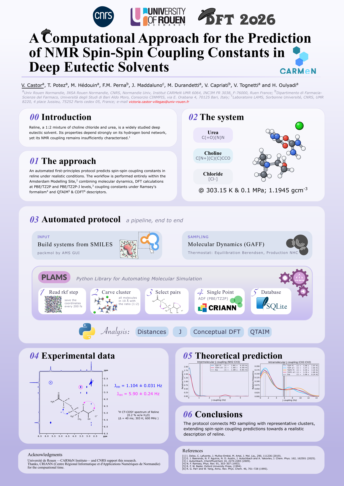

# DES NMR J-coupling pipeline

Theoretical study of NMR J-couplings in the urea / choline chloride Deep
Eutectic Solvent via Molecular Dynamics, Ramsey's theory, DFT, conceptual-DFT
and QTAIM (theoretical part of the paper DOI: ). MD snapshots are cut into
small clusters for single-point DFT J-coupling calculations; geometric and
quantum descriptors are stored with the J values in a SQLite DB.

## Poster (presented at the DFT 2026 conference in Donostia)

[](poster.pdf)


## Requirements

- AMS with PLAMS (`$AMSBIN/plams`)
- Python 3 with `numpy`, `matplotlib`, `seaborn`, `scipy`, `scikit-learn`
- LaTeX with `xfrac` and `amsmath` (the `notex` preset in
  `hassan_functions/style.py` plots without it)
- Perl, for `density.pl` only

## Directory layout

```
mdSteps/rkf/              # MD checkpoints (.rkf), fetched by mdSteps/update_mdsteps.sh
mdSteps/xyz/              # xyz per MD step
clusters/                 # inner-sphere cluster per step
amsoutput/<variant>/      # ADF NMR output: TZ2P_FC, TZ2P_all, TZ2PJ_FC, TZ2PJ_all
amsoutput/qtaim,cdft/     # QTAIM / conceptual DFT output
amsoutput/ch,nh,nh_intra/ # C(urea)-H, N(urea)-choline, intra-urea N-H coupling output
amsoutput/site/           # named-site (H1-H5, Nurea) coupling output
run_scripts/              # generated .run/.sl, same subdirectories as amsoutput/
pipeline/                 # rkf -> xyz -> clusters -> .run/.sl + DB rows
analysis/                 # analysis and plotting scripts
analysis/cache/           # pickled PLAMS results
plots/                    # figures
visual_clusters/          # representative clusters (repr_MDStep*.xyz)
nmr_jcoupling.db          # SQLite DB (schema in init_db.py)
hassan_functions/         # shared library
```

## Running

From the repo root:

```
init_db.py        # DB schema (uncomment the calls needed)
./generate.sh     # fetch new .rkf from aragorn, run pipeline/
./criann.sh       # upload .run/.sl, download .out, clean, submit H-H jobs on CRIANN
./reader.py       # parse outputs into the DB: J, QTAIM DI, CDFT chi, SCF flags
./analysis.sh     # generate.sh on new .rkf, rebuild stale PLAMS caches, plots
density.pl <log>  # mean ± std density, pressure, temperature of the MD
# ./density.pl ams.results/ams.log if production has no any particular name
```

`pipeline/` (run by `generate.sh`):

```
rkf_to_xyz.py          # mdSteps/rkf -> mdSteps/xyz
region_selector.py     # inner-sphere clusters, 2 urea : 1 choline chloride
coupling_generator.py  # DB rows + .run/.sl for the 4 NMR variants (H-H)
populate_geometry.py   # intra dihedral / distance / angle columns
property_generator.py  # QTAIM + CDFT .run/.sl for converged steps
```

Environment flags:

| Flag | Effect |
|---|---|
| `MIN_STEP=<n>` | skip MD steps before n (default 60000000 in `coupling_generator.py`, 0 in `property_generator.py`) |
| `COMPOSITION="u,c,cl;..."` | allowed (urea, choline, chloride) counts, default `2,1,1`; overrides the next two |
| `ALLOW_MEDIUM=1` | also allow `4,2,2` |
| `NO_SIZE_LIMIT=1` | any composition |
| `TAPE=SAVE` | bring back the whole work directory, not only the .out |
| `LIMIT=<n>` | `property_generator.py`: at most n steps |
| `CH=1`, `NH=1`, `SITE=1`, `NH_INTRA=1` | `coupling_generator.py`: only that coupling set instead of H-H, one per run (this precedence) |
| `CH_LIMIT`, `NH_LIMIT`, `SITE_LIMIT`, `NH_INTRA_LIMIT=<n>` | `coupling_generator.py`: cap on new .run/.sl for that set |
| `SMALL_LIMIT=<n>` | `coupling_generator.py`, H-H: the n smallest pending clusters |
| `SMALL_MAX=<n>` | `coupling_generator.py`, H-H: stop at the first cluster above n atoms |
| `VARIANTS=a,b` | `coupling_generator.py`, H-H: only these variants |
| `PARTITION=<p>` | `coupling_generator.py`, H-H: partition p (`court`, `tcourt`, `long`, `tlong`) with its walltime cap |
| `IGNORE_TIME=<ns>` | `coupling_generator.py`: skip the first ns of MD (set `MD_TIMESTEP_FS` first) |

`analysis/` (run by `analysis.sh`):

```
# PLAMS
distance_intra.py          # intra C-H / H-H distances and dihedrals
distance_inter.py          # urea-choline contact distances
gauche_anti.py             # N-CH2-CH2-O dihedrals
qtaim_analysis.py          # BCPs, QTAIM charges, Fukui functions
choline_fold.py            # choline O(H4)...H1 fold: BCPs and geometry
cl_environment.py          # chloride contacts and BCPs
nh2_environment.py         # urea NH2 (H5) contacts and BCPs
representative_cluster.py  # cluster with the most main interactions, fewest molecules (xyz)
interaction_matrix.py      # species / H-type interaction tables: contacts and BCPs

# Python
distance_plot.py           # distance / dihedral histograms
gauche_anti_plot.py        # gauche vs anti histogram
qtaim_analysis_plot.py     # BCP, charge and Fukui plots
cl_environment_plot.py     # chloride distances and BCPs
nh2_environment_plot.py    # H5 distances and BCPs
visualiser_data.py         # |J| H-H per variant vs experiment
variant_stats.py           # inter |J| per variant: power-mean sweep, p*
karplus_fit.py             # Karplus and descriptor fits
ch_coupling.py             # |J| C(urea)-H
nh_coupling.py             # |J| N(urea)-choline
nh_intra_coupling.py       # |J| N-H within one urea

# not run by analysis.sh
inter_criteria.py          # inter J selection criteria
direct_dij.py              # direct dipolar coupling |D_ij|
karplus_ml.py              # ML model, memory-heavy
smallDisQTAIM.py           # short N(urea)...H(CH3) contacts with / without BCP
```

J values are used as `|J|`; the average is the cubic power mean
(`hassan_functions/jstats.py`).

## Submission

This pipeline was run thanks to CRIANN computing time. `criann.sh`,
`run_scripts/to_criann.sh`, `amsoutput/download_outputs.sh` and
`hassan_functions/criann.py` are set for CRIANN: change hosts, paths, modules
and partitions for the machine where you launch your calculations.

## Atom indexing

Atom numbers in the DB and in the ADF / QTAIM / CDFT files follow the `.run`
order, not the `clusters/*.xyz` order: urea, choline, chloride, each sorted by
distance to the cluster centre, atoms numbered from 1. A script that looks up a
value by atom index must rebuild this order with `classify_sort` and
`compute_offsets`, as `pipeline/coupling_generator.py` does.

## `hassan_functions/` library

| Module | Contents |
|---|---|
| `geometry`  | `distance`, `angle`, `dihedral` |
| `finders`   | `find_atoms`, `find_xh_groups`, `find_xh_bonds`, `find_adjacent_xh_pairs`, `find_adjacent_xh_pair_anchored` |
| `ordering`  | `canonical_order`, `reorder`, `classify_sort`, `compute_offsets` |
| `io`        | `get_step_from_filename`, `read_xyz`, `normalise_symbol`, `read_labeled_matrix`, `read_qtaim_charges`, `read_cdft_fukui` |
| `db`        | `table_exists`, `column_exists` |
| `sites`     | `choline_sites`, `urea_sites`, `cluster_sites` (H1-H5, Nurea) |
| `cache`     | `save_cache`, `load_cache` (`analysis/cache/`) |
| `flags`     | `env_int`, `env_list`, `partition_override`, `verbose`, `vprint`, `allowed_compositions`, `cluster_composition`, `composition_allowed`, `SMALL_COMPOSITION`, `MEDIUM_COMPOSITION` |
| `criann`    | `slurm_script`, `PARTITION_WALLTIME`, `VARIANT_SLURM`, `SCF_WARNINGS`, `MODULE` |
| `jstats`    | `cubic_mean`, `cubic_dispersion`, `effective_n`, `cubic_mean_ci` |
| `plotting`  | `PLOT_STYLES`, `hist`, `mlabel`, `stats`, `style_axes`, `style_cbar`, `save_fig` |
| `params`    | plot font sizes, colours, markers, labels, `J_PHYSICAL_MAX_HZ` |
| `style`     | `apply_style(preset)`: `default`, `large`, `notex` |
| `constants` | `FORMULAS`, `SITE_LABELS`, `SITE_COUPLINGS`, `pair_type`, `ISOTOPE_FOR_SYMBOL`, `GAMMA`, physical constants |

### Adapting to a different system

1. Change `FORMULAS` in `hassan_functions/constants.py`.
2. Change `SPECIES_ATOMS`, `cluster_composition` and the composition tiers in
   `hassan_functions/flags.py`, or run with `NO_SIZE_LIMIT=1`.
3. Update every `SPECIES = [...]` in `pipeline/` and `analysis/`.
4. Change the finder calls, e.g. `find_xh_groups(water, 'O', 2)`.
5. Change `target_ratio` and `check_solution_ratio` in `pipeline/region_selector.py`.
